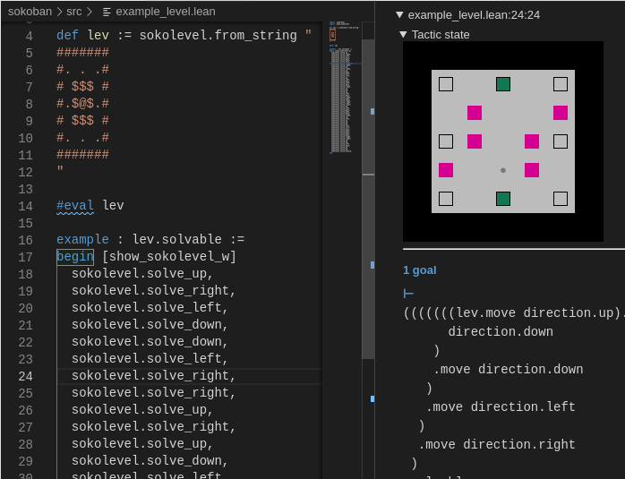
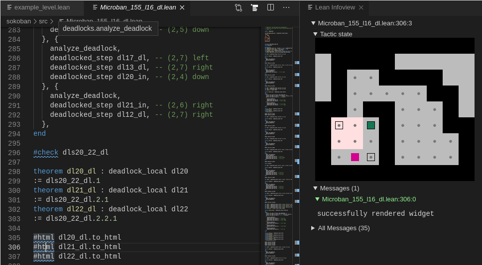

# sokoban.lean

Sokoban implementation in Lean for proving solvability / unsolvability.

See `example_level.lean` for solvability proof, or `example_deadlocks.lean` for proofs of deadlocks in a level. The solution / deadlocks can be also exported from [SokoDLex](https://github.com/mirefek/SokoDLex). Particular examples of exported files here are `XSokoban_90_l1_dl.lean`, `XSokoban_90_l1_sol.lean`, `Microban_155_l16_dl.lean`, however, these can be a bit hardware demanding (as they are real levels, and not just toy examples).

## Screenshots

`src/example_level.lean`

`src/Microban_155_l16_dl.lean`

